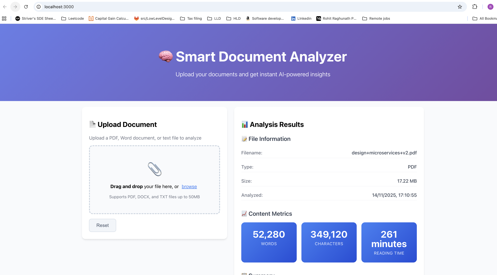
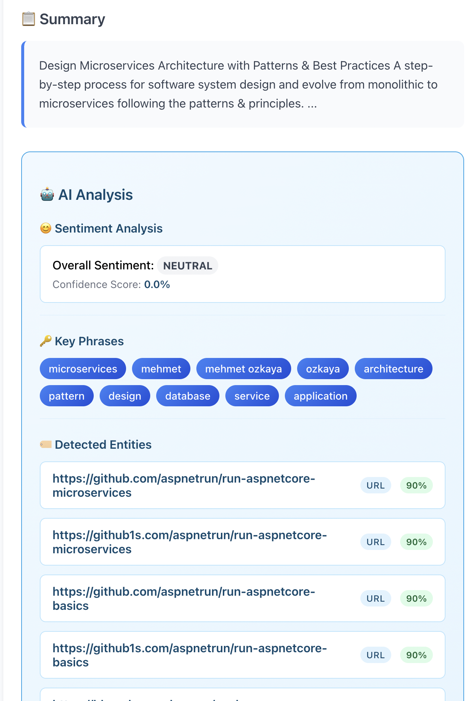
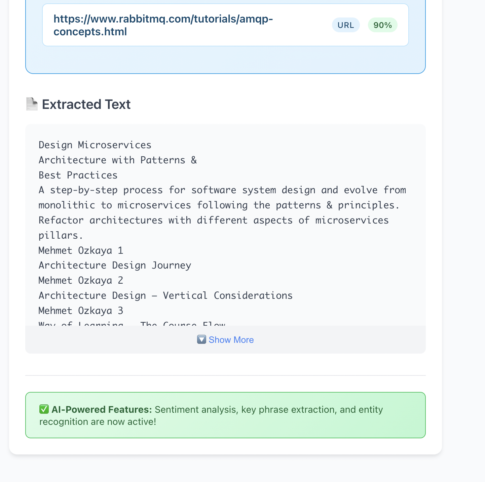

# 🧠 Smart Document Analyzer

## Project Overview

Smart Document Analyzer is a full-stack web application that allows users to upload PDF, Word, or text files and instantly receive AI-powered insights such as word count, reading time, and content analysis. The project demonstrates modern Java/Spring Boot backend and React frontend development, focusing on clean architecture, robust error handling, and a professional user experience.

---

## What is Implemented (MVP)

- **Frontend (React 18):**

  - Drag-and-drop document upload interface
  - File type and size validation with user-friendly error messages
  - Real-time display of analysis results (word count, character count, reading time, summary)
  - Responsive design for desktop and mobile

- **Backend (Spring Boot 3, Java 17+):**
  - REST API for document upload and analysis
  - Text extraction from PDF (Apache PDFBox), DOCX (Apache POI), and TXT files
  - Content analysis: word/character count, reading time, summary
  - Health check endpoint

---


## 🚀 Features

### ✅ Current (MVP)

- **Document Upload**: Drag-and-drop interface for PDF, DOCX, and TXT files
- **Text Extraction**: Extract text content from uploaded documents
- **Content Analysis**:
  - Word count and character count
  - Reading time estimation
  - Document summary generation
- **Real-time Processing**: Instant analysis results
- **Responsive UI**: Works on desktop and mobile devices
- **File Validation**: Type and size validation with user-friendly error messages

### 🔄 Coming Soon (Phase 2)

- **AWS Integration**:
  - S3 for secure file storage
  - AWS Comprehend for sentiment analysis
  - AWS Textract for advanced PDF processing
- **Document Categorization**: Automatic classification of document types
- **Keyword Extraction**: Identify important terms and phrases
- **Multi-language Support**: Process documents in multiple languages

### � Future Enhancements (Phase 3)

- **User Authentication**: Secure login with JWT
- **Analysis History**: Save and view previous analyses
- **Batch Processing**: Upload and analyze multiple documents
- **Export Features**: Download analysis reports as PDF/CSV
- **Dashboard**: Analytics and insights visualization

## 🏗️ Architecture

```
┌─────────────────┐    HTTP/REST API    ┌──────────────────┐
│   React Frontend│◄─────────────────────┤ Spring Boot API  │
│   (Port 3000)   │                     │   (Port 8080)    │
└─────────────────┘                     └──────────────────┘
         │                                        │
         │                                        │
         ▼                                        ▼
┌─────────────────┐                     ┌──────────────────┐
│  UI Components  │                     │  Document Service│
│  - Upload Form  │                     │  - Text Extract  │
│  - Results View │                     │  - Analysis      │
│  - Error Handle │                     │  - File Validate │
└─────────────────┘                     └──────────────────┘
```

## 🛠️ Tech Stack

### Backend

- **Java 17+** - Modern Java features
- **Spring Boot 3** - REST API framework
- **Apache PDFBox 3** - PDF text extraction
- **Apache POI 5** - DOCX processing
- **Maven** - Dependency management

### Frontend

- **React 18** - UI framework
- **Axios** - HTTP client
- **CSS3** - Modern styling with flexbox/grid
- **HTML5** - Semantic markup

### Development Tools

- **VS Code** - IDE
- **Maven** - Build automation
- **npm** - Package management
- **Git** - Version control

## 🛠️ Installation & Setup Guide

### Prerequisites

- Node.js 16+ and npm
- Java 17+
- Maven 3.6+

### 1. Clone the Repository

```bash
git clone <repository-url>
cd smart-document-analyzer
```

### 2. Start the Backend

```bash
cd backend
mvn clean install
java -jar target/smart-document-analyzer-0.0.1-SNAPSHOT.jar
```

Backend will be available at: [http://localhost:8080](http://localhost:8080)

### 3. Start the Frontend

```bash
cd frontend
npm install
npm start
```

Frontend will be available at: [http://localhost:3000](http://localhost:3000)

### 4. Verify Setup

- Check backend health: `curl http://localhost:8080/api/documents/health`
- Open [http://localhost:3000](http://localhost:3000) in your browser

## � API Documentation

### Upload Document

```http
POST /api/documents/upload
Content-Type: multipart/form-data
Body: file (PDF/DOCX/TXT)

Response: {
  "id": "doc-123",
  "filename": "example.pdf",
  "fileType": "pdf",
  "fileSize": 1024,
  "wordCount": 500,
  "characterCount": 3000,
  "readingTime": "3 minutes",
  "summary": "Document summary...",
  "extractedText": "Full text content...",
  "analyzedAt": "2025-11-14 14:30:00"
}
```

### Get Analysis

```http
GET /api/documents/{id}/analysis

Response: DocumentAnalysis object
```

### Health Check

```http
GET /api/documents/health

Response: {
  "status": "UP",
  "service": "Smart Document Analyzer API"
}
```

## 🧪 Testing

### Test with Sample Document

1. Start both backend and frontend servers
2. Open http://localhost:3000
3. Upload the provided `test-document.txt` file
4. Verify analysis results appear correctly

### Backend API Testing

```bash
# Test health endpoint
curl http://localhost:8080/api/documents/health

# Test file upload
curl -X POST -F "file=@test-document.txt" \
     http://localhost:8080/api/documents/upload
```

## 🎨 UI Screenshots

### Upload Interface



### Analysis Results




**Features shown:**

- Clean drag-and-drop area
- File type and size validation
- Loading spinner
- File information display
- Colorful metrics cards
- Expandable text preview
- Professional styling

## � Development Notes

### File Processing

- **PDF**: Uses Apache PDFBox for reliable text extraction
- **DOCX**: Uses Apache POI for Microsoft Word documents
- **TXT**: Direct text processing

### Error Handling

- Client-side file validation
- Server-side error responses
- User-friendly error messages
- Network error recovery

### Performance

- Streaming file upload
- Efficient text processing
- Responsive UI design
- Proper loading states

## 🚀 Deployment Ready

### Environment Variables

```bash
# Backend
JAVA_OPTS="-Xmx512m"
SERVER_PORT=8080

# Frontend
REACT_APP_API_URL=http://localhost:8080/api
```

### Docker Support (Coming Soon)

```dockerfile
# Backend Dockerfile
FROM openjdk:17-jre-slim
COPY target/smart-document-analyzer*.jar app.jar
EXPOSE 8080
CMD ["java", "-jar", "app.jar"]

# Frontend Dockerfile
FROM node:16-alpine
COPY . .
RUN npm install && npm run build
EXPOSE 3000
CMD ["npm", "start"]
```

## 🤝 Contributing

This is a portfolio project demonstrating:

- Full-stack development skills
- Modern Java/Spring Boot backend
- React frontend development
- RESTful API design
- File processing capabilities
- Clean, professional UI/UX

## 📝 Interview Highlights

### Technical Skills Demonstrated

- **Java 17** with Spring Boot 3
- **React 18** with modern hooks
- **RESTful API** design and implementation
- **File processing** with Apache libraries
- **Error handling** and validation
- **Responsive design** with CSS3
- **Git workflow** and project structure

### Best Practices

- Constructor injection over field injection
- Proper error handling and logging
- Clean code principles
- Separation of concerns
- RESTful API design patterns
- Responsive UI/UX design

### Extensibility

- Ready for AWS integration
- Database integration ready
- Authentication system ready
- Containerization ready
- CI/CD pipeline ready

---

**Built with ❤️ for portfolio demonstration**

_This project showcases full-stack development capabilities using Java, Spring Boot, React, and modern web technologies._
